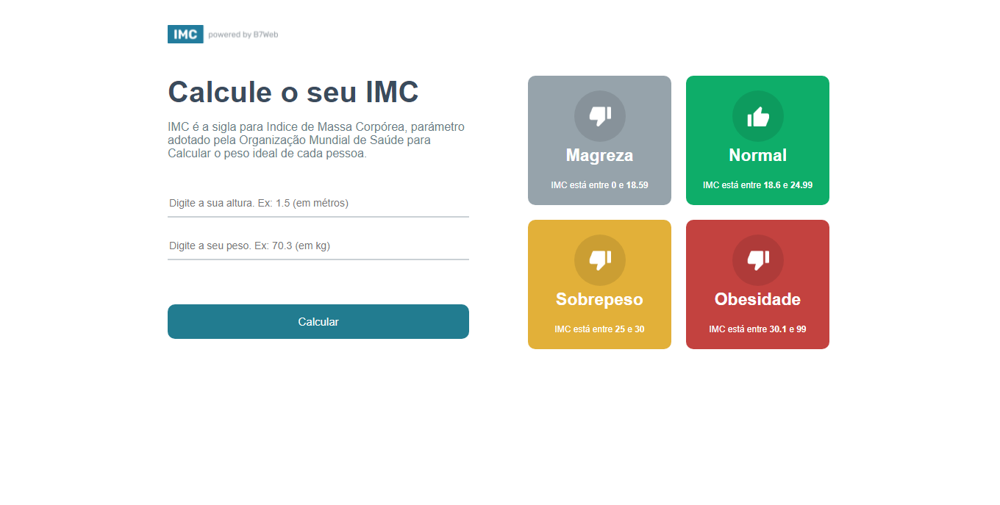

<h2 align="center"> 
  
</h2>

---
## Sobre
#### **Projeto IMC:**  IMC é a sigla para Indice de Massa Corpórea, parámetro adotado pela Organização Mundial de Saúde para Calcular o peso ideal de cada pessoa.

---

Projeto em React + Typecript  desenvolvido durante o curso [B7Web](https://b7web.com.br).

---
<!-- ### Modo responsivel 
  -->

### Instalação
- `npm install`

### Para rodar 
- `npm run dev`
